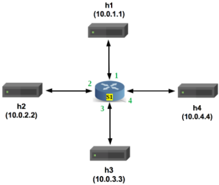
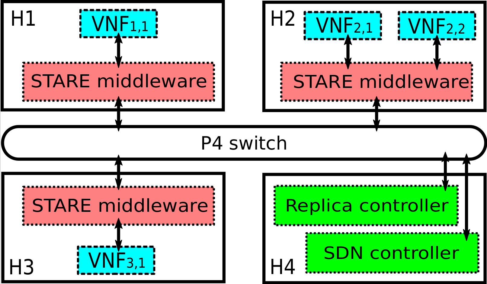

# State Sharing with P4

## Motivation

Advanced network applications are based on stateful VNFs, i.e. an internal state is kept within the VNF during the traffic operations. Typical examples are traffic classifier, traffic shapers, firewalls. Scaling such network application for large networks and/or for high data rate requires to replicate the same VNF into different servers and to distribute the traffic across all the instances of the VNF. This coordination between VNFs requires that the internal state should be shared across the replicas. As a toy example consider a distributed Deny-of-Service Detection (DoSD) application in which many replicas of the same VNF are distributed at different ingress routers of a network. The detection is based on evaluating the overall traffic entering the network from all edge routers. This application requires to share the metrics of the local traffic among the VNF replicas in order to compute the network-wide traffic. A possible solution for state replication would be to implement a standard replication protocol directly in the VNF (like Paxos, RAFT, etc), but this requires to load the VNF with also this replication process, which can be quite complex and computation intensive.
An alternative solution is to leverage a stateful data plane, e.g., based on P4. This implies that the state replication is offloaded from the VNFs to the P4 switches, which take the responsibility of coordinating the exchange of replication messages between VNFs, with a beneficial effect on the VNF load and thus on the overall scalability.
In particular, the 5G EVE project is investigating how to implement a publish-subscribe scheme directly on P4 switches, according to which the VNFs can publish the updates on their internal states and can subscribe on the updates from the other VNFs. This allows to achieve a state replication which is light for the VNFs and that exploits the high processing speed of P4 switches.  

This work has been supported through the [5G EVE Project](https://www.5g-eve.eu/), 
i.e., the European 5G validation platform for extensive trials, funded by the European Horizon 2020 Programme for research, technological development and demonstration (grant agreement n.815074). 

## Introduction

In this repository a sample solution for State sharing is prepared
by help of the `P4 language`, `python` and the `PUBLISH/SUBSCRIBE` scheme. 

In simple words, we have some `Network Functions` that want to `Publish` 
information on some `variables`, they are not aware of each other existence
or the place of the other Network Functions in the network, and they want
to have a selective access to the others publishes.
Their information is limited to the variable names and the address of 
the `REPLICA controller`. We tried to implement a simple case that can 
demonestrate well the idea.

For the sack of simplicity, we start four hosts, then we run four Network
Functions inside three of those hosts(two hosts has only one Network Function
and one host has two Network Functions) and one REPLICA controller inside
the forth host.

In this implementation, all the Network Functions will initialize themselves
by communicating with the REPLICA controller and each one will publish on one 
unique variable, then one of the two Network Functions which is sharing the
same host, will SUBSCRIBE on the other three variables which are being published
by the other three Network Functions. The P4 switch is responcible to do the 
registerations and forward the publishes to the subscribers.

**HINT:**
In this example, the subscriber Network Function is sharing its host with one of 
the publisher Network Functions. As the subscriber Network Function is subscribing 
on the variable of this publisher Network Function, so do we need to route the 
published data to the P4 switch and then again to the same host? 
As an example for the solution to save the resources(bandwith, P4 switch internal
resources, etc.), we implemented a simple `Middle-ware` to be placed between the 
Network Functions of each host and the host itself.

A simple structure and its internal view is demonstrated here: 

  
   

 

## Presentation

1. By using the internal registers
* [Register-based solution](./pubsub/pubsub_register)

For starting with the P4 language, one can refer to the [P4 tutorial](https://github.com/p4lang/tutorials), prepared by the [P4.ORG](https://p4.org/) as a learning source.

## Obtaining required software

The environment for running and the instructions for this part
is derived from the [P4 tutorial](https://github.com/p4lang/tutorials).

To run the proposed solutions, you will need to either build a
virtual machine or install several dependencies. If the first approach failed
due to any error, try to use an Ubuntu 16.04 machine and using the the second 
approach to install the dependencies.

1.To build the virtual machine:
- Install [Vagrant](https://vagrantup.com) and [VirtualBox](https://virtualbox.org)
- Clone the repository
- `cd vm`
- `vagrant up`
- Log in with username `p4` and password `p4` and issue the command `sudo shutdown -r now`
- When the machine reboots, you should have a graphical desktop machine with the required
software pre-installed.

*Note: Before running the `vagrant up` command, make sure you have enabled virtualization in your environment; otherwise you may get a "VT-x is disabled in the BIOS for both all CPU modes" error. Check [this](https://stackoverflow.com/questions/33304393/vt-x-is-disabled-in-the-bios-for-both-all-cpu-modes-verr-vmx-msr-all-vmx-disabl) for enabling it in virtualbox and/or BIOS for different system configurations.*

You will need the script to execute to completion before you can see the `p4` login on your virtual machine's GUI. In some cases, the `vagrant up` command brings up only the default `vagrant` login with the password `vagrant`. Dependencies may or may not have been installed for you to proceed with running P4 programs. Please refer the [existing issues](https://github.com/p4lang/tutorials/issues) to help fix your problem or create a new one if your specific problem isn't addressed there.*

2.To install dependencies by hand, please reference the [vm](./vm) installation scripts.
They contain the dependencies, versions, and installation procedure.
You should be able to run them directly on an Ubuntu 16.04 machine, although note that the scripts currently assume the existence of a directory `/home/vagrant`:
- `sudo ./root-bootstrap.sh`
- `sudo ./user-bootstrap.sh`
