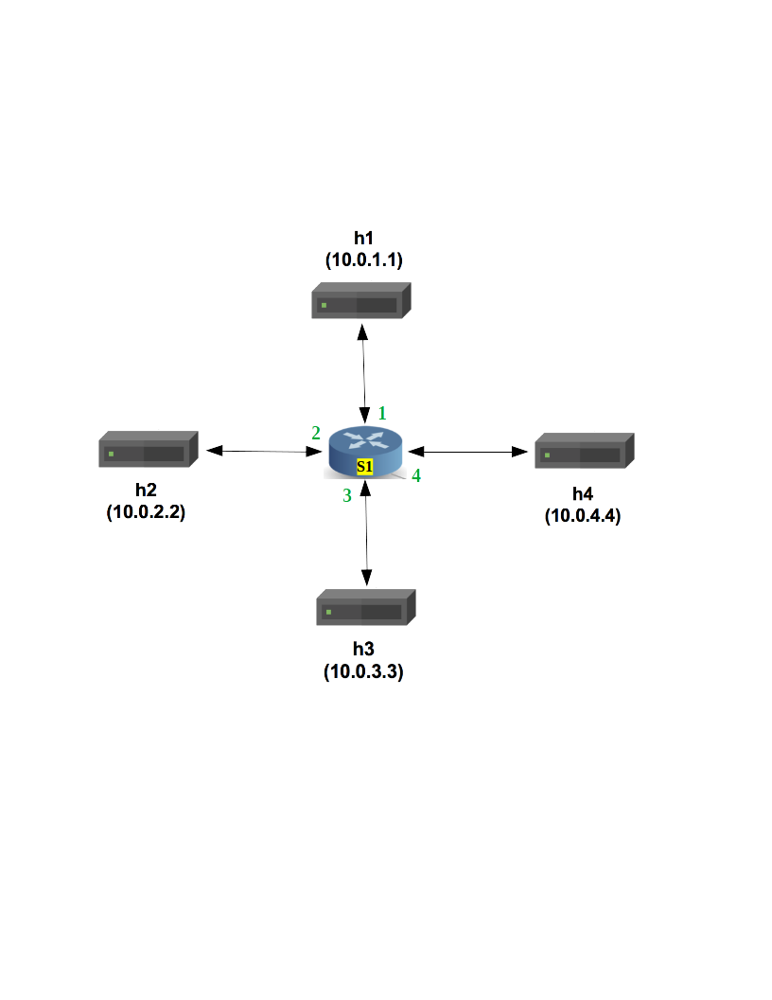
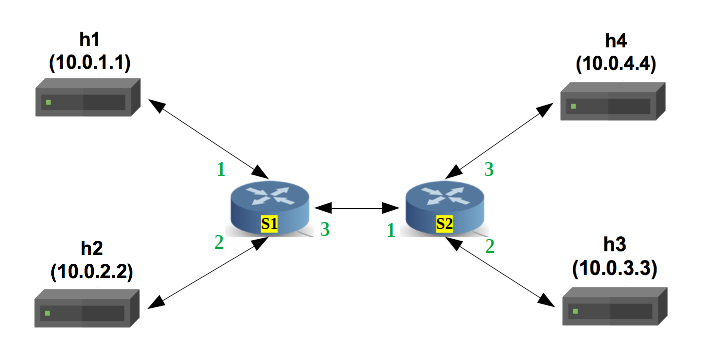
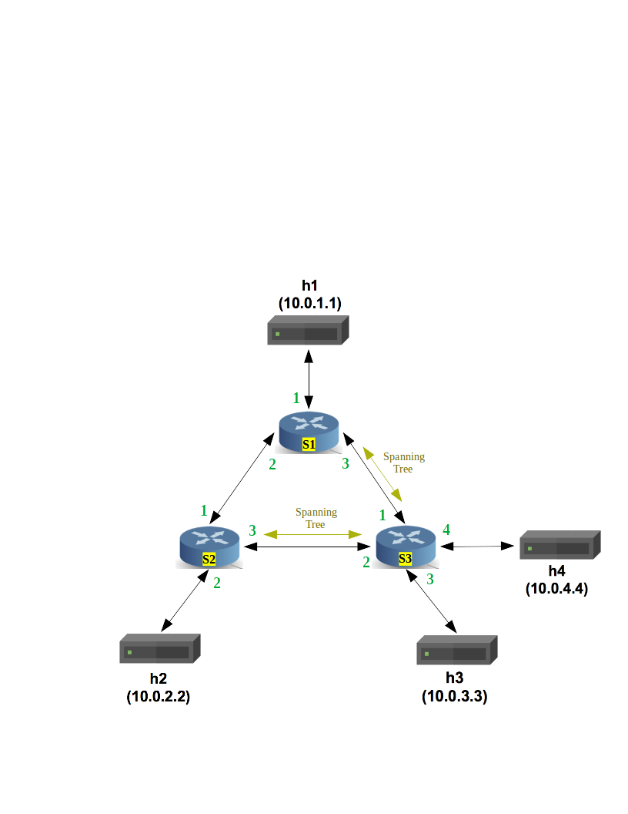

# Implementing the Register-based solution

## Introduction

The objective of this basic solution is to show that by using the
internal registers of the ingress pipeline one can deploy the
`PUBLISH/SUBSCRIBE` scheme to be used by different applications.

To keep things simple, we just used IPv4 forwarding for some basic
data transfer and some registers to do the main part related to the
forwarding the published data based on the registrations made on them.

With IPv4 forwarding, the switch must perform the following actions
for every normal packet which is not one of our special kinds:

(i) update the source and destination MAC addresses.

(ii) decrement the time-to-live (TTL) in the IP header.

(iii) forward the packet out the appropriate port.

With `subIndxPort` registers, the switch must perform the following
actions for every `PubSub` packet:

(i) If it is a registration request, the switch will write a positional
    map of the input port to the proper register with the index equal to
    the `id` of the requested `variable`, or the reverse actions, if it was
    a remove request.
    
(ii) Forwards the request to other P4-switches, if any, through the
    `Distribution tree` that is already prepared by the main controller
    in the switch.
    
(iii) If it is a publish packet, the switch will checks the the internal
    register with index equal to the `id` of the published `variable`, and
    will `multicast` the packet to the ports which are written in that
    mentioned register, otherwise drops the packet.

The switch have a single IPv4 forwarding table, which the control plane
will populate it with static rules for each topology. Each rule will map
an IP address to the MAC address and output port for the next hop.
Four registers for handling four variables, and a multicast table with one
entry for the distribution tree, which the control plane will populate it with
static rules for each topology.

We can use the following topologies for this design.

1. A single switch topology which is referred to as single-topo:
   

2. A linear topology with two switches, which is referred to as
   linear-topo:
   

3. A triangular topology with three switches, which is referred
   to as triangular-topo:
   

To use any of them, one should replace the topology address mentioned
in the `MakeFile` with the desired topology.

Our P4 program is written for the V1Model architecture implemented
on P4.org's bmv2 software switch. The architecture file for the V1Model
can be found at:[Here](/usr/local/share/p4c/p4include/v1model.p4). This file
describes the interfaces of the P4 programmable elements in the architecture,
the supported externs, as well as the architecture's standard metadata
fields. We encourage you to take a look at it.

## Start the environment with the desired topology and run the sample solution

Start by bringing up our structure in the Mininet to test its behavior.

1. Open a terminal and go to the address 
`home/p4/State-Sharing-p4-python/pubsub/pubsub_register`

2. In your shell, run:
   ```bash
   make clean && make all
   ```
   This will:
   * compile `pubsub.p4`, and
   * start the single-topo in Mininet and configure the switch with
   the appropriate P4 program + table entries, registers, and
   * configure all hosts with the commands listed in
   `single-topo/topology.json`

3. You should now see a Mininet command prompt. Start with opening
   one terminal for each host in the topology:
   ```bash
   mininet> xterm h1 h2 h3 h4
   ```

4. Start the REPLICA controller in `h4` by running the
   `./REPLICA_controller.py`, and start one MIDDLE-WARE in every
   other hosts`(h1, h2 and h3)` by running `./pubsub_MW.py` in each of
   them. now you have a ready system for start the main goal.

5. Except for the `h4`, open one terminal in each other hosts`(h1, h2
   and h3)` by doing in the Mininet prompt:
   ```bash
   mininet> xterm h1 h2 h3
   ```

6. For simplicity, in each of the three new terminals, start the
   PUBSUB-NF by running `./pubsub_NF.py --n X`, which `X` is `(0, 1 and 2)`
   for each host respectively.
   e.g. `./pubsub_NF.py --n 0` in `h1`, `./pubsub_NF.py --n 1` in `h2` and
   `./pubsub_NF.py --n 2` in `h3`. You will see ID assignments for the
   NFs and their PUBLISH variables, wait until all of the three NFs
   start to PUBLISH.

7. From the Mininet prompt start only one terminal in one of the
   hosts from `(h1, h2 and h3)` by your choice:
   ```bash
   mininet> xterm hx
   ```
   Where `x` is one of the `(1, 2 and 3)`, you should have 8 terminals by now.
   Start another NF by running `./pubsub_NF.py --n 3` inside this terminal. 
   You will see the same procedure for this NF too. But after starting to
   PUBLISH on its variable,it starts to ask for the id of the some other variables,
   and eventually subscribing on them in the switches. You will see that this 
   NF is receiving the other NF publishes for the variables it requested.

8. In another terminal outside the Mininet(a regular terminal of the
   system) run this command:
   ```bash
   bm_CLI --thrift-port 9090 --json build/pub_sub.json --pre SimpleSwitchLAG
   ```
   You will see another command line, enter the bellow command and see
   the results:
   ```bash
   register_read subIndxPort
   ```
   you can see the registers with the number inside each of them. Starting
   from the left, the index of the register is the `variable_id - 1`, while 
   the numbers are the multicast groups assigned to those registers. The ids 
   for the variables are assigned by the REPLICA controller.
   
   **Important:** if you are using the toplogies with more than one switch, for
   each switch in the topology you should repeat this part, noticing that for the `S1`
   the thrift port is `9090` and for the rest one should use `9091` for `S2` and `9092` for `S3`.

8. In the Mininet command line type `exit` to close all the xterminals.
   Then, to stop mininet:
   ```bash
   make stop
   ```
   And to delete all pcaps, build files, and logs:
   ```bash
   make clean
   ```

### A note about the logs

By starting the REPLICA controller, MIDDLE-WAREs and the NFs, they build
a log file containing a simplified details about what is happening inside
them. An external copy of the data for each published variable and for
each received publish can be found there to trace the correctness of the
algorithm.
